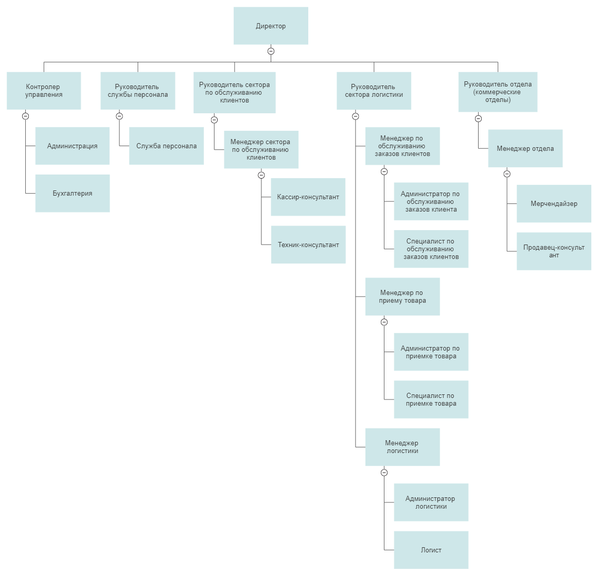

| Управление информационно-технологическими проектами. Задание №1 |
| --- |
| ФИО: **Кулагин Иван Антонович** |
| Группа: **ИКБО-02-19** |

**Часть 1. История.**

**Название:** «YorelRemlin», предприятие розничной торговли (ритейл) DIY-сегмента.

**Предметная область:**

DIY-сети в России представлены на рынке в формате гипермаркетов с широким ассортиментом товаров для строительства и обустройства дома, и различных дачно-садовых принадлежностей.

Рынок DIY представляет торговлю товарами для:

- строительства (HardDIY, товары для строительства, капитального ремонта и черновой отделки);
- отделки (SoftDIY, товары для внутренней отделки и косметического ремонта);
- обустройства дома (Household, включающие комнатные растения, предметы декора, интерьера и освещение);
- обустройства дачи и сада (Garden, включают: растения, грунт, оборудование для готовки на воздухе и садовую мебель).

**Стратегические цели:**

Построение платформы по благоустройству дома, полезной для с точки зрения снижения и компенсации негативного влияния на окружающую среду в результате своей деятельности.

_Приоритетные задачи:_

1. Снижение экологического следа, поддержка местных сообществ, способствуя улучшению качества жизни, Развитие человеческого потенциала (сотрудники, жители, партнеры в сфере ремонта и обустройства) через постоянное обучение и развитие компетенций, позволяющие строить надежное будущее, продвижение ответственного потребления, вместе с партнерами делая доступными максимальному количеству людей ответственные решения для обустройства дома;
2. Укрепление электронной коммерции;
3. Развитие работы с профессионалами;
4. Увеличение территориального покрытия после ухода игроков с рынка из-за COVID-19.

**История развития:**

Предприятие розничной торговли «YorelRemlin» было образовано как плод вдохновения ритейл-сетью «LeroyMerlin», пытаясь перенять опыт и усовершенствовать идеи крупного французского предприятия.

На DIY-рынок компания «Yorel Remlin» вышла в 2016 году, открыв свою первую точку в Калуге. На фоне роста интереса к DIY в России, был открыт филиал в Московской области – в 20 километрах от столицы, в Мытищах; расширение сети и неуклонный, стабильный рост доходов позволили уже в 2018 году, всего через два года после своего появления, занять компании лидирующее место среди аналогичных DIY-сетей по количеству товаров в предлагаемом ассортименте и другим показателям.

**Достижения:**

Цифровая революция, покрытие, лидер DIY сегмента

**Проблемы:**

Логистика отправок и поставок, распределение и доступность запаса, управление складскими помещениями, электронная коммерция, образование цен, развитие и управление недвижимостью.

**Организационная структура, масштабы:**

В «YorelRemlin» установлена линейно-функциональная организационная структура.

В организации работает 250 человек, по количественному признаку преобладает категория «рабочие» – 80 %; менеджеры составляют 15% персонала, лишь оставшиеся 5% занимают руководящие должности.

Организационная структура предприятия представлена на Рисунке 1.

**Рисунок 1 – Организационная структура**

**Территория:**

По состоянию на начало 2021 года сеть «YorelRemlin» включала уже 120 помещений розничной торговли, а в конце лета 2022 года в сети насчитывалось уже 180 точек. В настоящее время предприятие занимает первое место в России среди DIY-сегмента по товарообороту и числу активных покупателей.

Выбор месторасположения новых точек основывается на выгодном экономико-географическим положении, которое способствует притоку значительного количества посетителей.

Диапазон торговых площадей составляет от 6 000 до 15 000 квадратных метров.

**Часть 2. Идея.**

**Цель:** развитие технических решений, решающих проблемы логистики.

**Задачи:**

- определение поставщика на основе анализа различных показателей;

**Показатели:**

Проект нацелен на увеличение товарооборота и чистой прибыли предприятия за счёт уменьшения временных затрат на транспортировку;

**Пользователи, на которых ориентирован проект:**

Сотрудники сектора логистики предприятия

**Требования:**

Определение поставщиков для необходимых товаров на основе анализа данных о свободных транспортных средствах, наличии товаров на складах, информации о времени прибытия товара к поставщику, расстояния до склада поставщика и трафика дорожных путей.

**Текущий уровень автоматизации, ПО:**

Система управления логистикой и цепями поставок;

**Бизнес-процессы, взаимосвязь:**

_Ключевые бизнес-процессы:_

- Определить список товаров на закупку
- Определить поставщиков
- Закупка товара

Филиалу предприятия поступают заказы от клиентов на определенные товары. На основе заказов формируется список товаров на закупку.

Стоит задача определить оптимальных поставщиков по финансовым и временным затратам. Сотрудник отдела логистики с помощью ИС вносит нужные товары для закупки, и система генерирует таблицу с данными о заявках, включающих товары и потенциально оптимальных поставщиков этих товаров.

На основе сформированной таблицы сотрудник отдела закупок формирует и отправляет заказы поставщикам.
